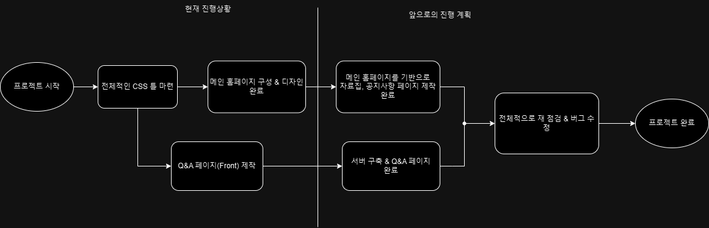
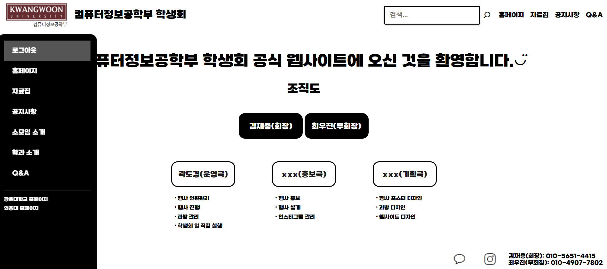

# Project progress
## Project summary
1. 메인 홈페이지 스타일링(HTML, CSS) 완료  
2. Q&A 페이지 로컬에 저장 기능 구현 완료

## Elements to be developed
1. 공지사항 파트
2. 자료집 파트
3. Q&A 페이지 서버 구축
4. main page 만들기 

## Project schedule
~12.5 : 공지사항 자료집 파트 작성 완료 && Q&A 페이지 서버 구축 완료
~12.9 : 버그, 디테일 수정 --> 최종 완성

## Schematic drawing

## Project screenshot

## Individual progress

### 최우진
:# Project Progress Report

### 자료집 초기 설계 문제점
기존 알고리즘에서는 특정 자료를 클릭했을 때 새로운 화면이 별도의 탭에서 열리도록 설계되어 있었습니다.  
이러한 방식은 사용자가 '뒤로 가기' 버튼을 눌렀을 때 초기 화면으로 바로 돌아가지 않고, 새로 생성된 페이지가 따로 표시되는 비효율적인 문제가 있었습니다.  
이로 인해 사용자가 자료를 확인한 후 초기 화면으로 돌아가기 위해 두 번의 페이지 전환을 해야 하는 번거로움이 있었습니다.  
이러한 구조는 간단한 자료 탐색에서도 불필요한 클릭을 유발하며, 사용자 경험(UX)을 저해하는 결과를 초래하였습니다.

---

## 기능 개선: 단일 페이지에서 동적 콘텐츠 로드
- 처음 화면을 동적으로 저장해두고, 사용자가 특정 자료를 선택한 후 '뒤로 가기'를 누르면 초기 화면이 바로 로드되도록 설계를 변경했습니다.  
- 이를 위해 HTML과 JavaScript를 활용하여 동적 콘텐츠 로드 방식을 구현하였습니다.  
- 각 자료 항목에 클릭 이벤트를 연결하여 필요한 콘텐츠만 동적으로 삽입하고, '뒤로 가기' 버튼을 클릭했을 때 저장된 초기 화면이 다시 표시되도록 설정했습니다.  
- 페이지 전환 없이 부드럽게 콘텐츠를 교체할 수 있도록 개선되었으며, 새로운 탭을 열지 않아도 원하는 자료를 확인할 수 있도록 했습니다.  
[Commit Link](https://github.com/kh-woo/WebSandbox_1/tree/develop_wjchoi)

---

## 로고 활용
- 브라우저 탭에 표시되는 기본 파비콘을 광운대학교 로고로 변경하여 학과의 정체성을 강화했습니다.  
- 로고 이미지를 `.ico` 형식으로 변환한 후, 태그를 사용해 브라우저에 적용했습니다.  
- 이를 통해 사용자들이 웹페이지를 탐색하면서 학과의 소속감을 느낄 수 있도록 했습니다.  
[Commit Link](https://github.com/kh-woo/WebSandbox_1/tree/develop_wjchoi)

---

## 반응형 웹 구현
- 레이아웃을 플렉스박스 기반으로 설계하여 데스크톱과 모바일 환경에서도 자연스럽게 표시되도록 개선했습니다.  
- 헤더와 푸터는 화면 크기에 따라 적절히 조정되도록 설정하였으며, 모든 콘텐츠가 중앙 정렬되도록 디자인을 최적화했습니다.  
- 이를 통해 다양한 디바이스에서도 일관된 사용자 경험을 제공할 수 있도록 했습니다.  
[Commit Link](https://github.com/kh-woo/WebSandbox_1/tree/develop_wjchoi)
---

## 네비게이션 구조 및 디자인 개선
- 초기 네비게이션은 모든 링크가 항상 고정된 상태로 상단에 표시되어, 시각적으로 혼잡한 느낌을 주었습니다.  
- 이를 개선하기 위해 네비게이션 메뉴를 기본적으로 숨기고, 사용자가 마우스를 헤더 영역에 올렸을 때만 표시되도록 변경했습니다.  
- CSS의 `hover` 이벤트를 활용하여, 기본 상태에서는 `display: none`으로 숨겨진 메뉴가 `header:hover` 시 `display: flex`로 나타나도록 설정했습니다.  
- 화면 상단을 간결하게 유지하면서도 사용자가 필요할 때 직관적으로 메뉴를 접근할 수 있도록 개선되었습니다.  
[Commit Link](https://github.com/kh-woo/WebSandbox_1/tree/develop_wjchoi)

---

## 탭 동작 개선
- 기존에는 자료를 클릭하면 새로운 탭에서 해당 화면이 열리는 방식이었습니다. 이는 브라우저 내 불필요한 탭을 다수 열리게 만들어 사용성을 떨어뜨리는 원인이 되었습니다.  
- 모든 링크에서 `target="_blank"` 속성을 제거하여 클릭 시 같은 탭에서 페이지가 전환되도록 수정했습니다.  
- 이를 통해 페이지의 흐름이 자연스럽게 유지되며, 사용자가 브라우저 내에서 더욱 효율적으로 탐색할 수 있도록 개선되었습니다.  
[Commit Link](https://github.com/kh-woo/WebSandbox_1/tree/develop_wjchoi)

---

## 푸터 고정
- 기존 푸터는 화면 내용의 길이에 따라 위치가 달라지는 구조였습니다. 짧은 내용의 페이지에서는 푸터가 화면 중간에 떠 있는 문제가 있었습니다.  
- 이를 해결하기 위해 CSS의 `position: fixed` 속성을 활용하여 푸터를 항상 화면 하단에 고정했습니다.  
- 이를 통해 푸터가 페이지 내용과 관계없이 일정한 위치에 배치되며, 디자인과 기능의 일관성을 유지할 수 있도록 했습니다.  
[Commit Link](https://github.com/kh-woo/WebSandbox_1/tree/develop_wjchoi)

### 김경목
:자료집파트 맡음. 학기별 추천 시간표 완성, 기타 자료 탭 생성 및 간단한 추가, 공부 자료 레이아웃 정리, 외부 사이트로 이동시에는 새로 탭 생기게 수정, 색상 수정, 소모임 사이트 간단한 디자인 설계.
### 김경목

## 자료집 기능 설계 및 구현
   각 학기별 추천 시간표를 그리드 형식으로 재구성하여 사용자가 학기별로 효율적으로 자료를 탐색할 수 있도록 개선했습니다.
   레이아웃을 2행 3열로 나누어 학기별 순서(1-1, 2-1, 3-1 → 1-2, 2-2, 3-2)로 배열되도록 구성했습니다.
   이를 통해 시각적인 가독성을 높이고, 학기별 자료 간의 연관성을 직관적으로 파악할 수 있게 했습니다.
   Commit Link : https://github.com/kh-woo/WebSandbox_1/commit/74a5a349b9ccfcd5503af7d567c6a33b120f194f

## 소모임 활동 내역 종합

## 공부 자료 레이아웃 정리 & 기타 자료 탭 생성
   기존의 단순 링크 나열 방식에서 벗어나 학기별 자료를 학기 순서대로 배치하였습니다.
   추천 시간표와 동일한 그리드 형식(2행 3열)으로 구성하여 일관성 있는 사용자 경험을 제공했습니다.
   학기별 자료에 해당하는 링크(미구현)를 추가하여 링크만 넣으면 사용자가 자료를 바로 확인할 수 있도록 했습니다.
   새로운 "기타 자료" 탭을 추가하여 사용자가 기존 카테고리에 포함되지 않은 자료를 확인할 수 있도록 확장성을 확보했습니다.
   기타 자료 탭에 두 개의 유용한 링크(에브리타임 꿀팁 모음, Klas Helper 다운로드)를 포함하여, 실질적인 학습 자료를 제공했습니다.
   외부 링크 클릭 시 새로운 페이지가 뜨게 개선하였습니다.
   Commit Link : https://github.com/kh-woo/WebSandbox_1/commit/6e2372e4226c55e2624ec1b337a7af8151e1314a

## 소모임 페이지 디자인 설계
   소모임 페이지의 네비게이션 구조를 개선하고, 각 소모임 섹션에 배경 이미지를 추가하여 디자인적인 완성도를 높였습니다.
   Commit Link : https://github.com/kh-woo/WebSandbox_1/commit/3020517bfb68655393615503784d4757fbb63e89
   Commit Link : https://github.com/kh-woo/WebSandbox_1/commit/bf3003678b3911c1f34a951e633533ad125a2560

## 색상 및 스타일링 조정 및 알고리즘 수정 
   뒤로 가기 화살표의 색상을 조금 더 눈에 띄게 수정하였고, 자료집 페이지에서 화살표를 클릭하였을 때 저장해두었던 초기 화면이 뜨게 설정하였습니다.
   Commit Link : https://github.com/kh-woo/WebSandbox_1/commit/edd60046659a89cfecec09a8e0fa489dbbd7084d

### 김현우
## Main Page 구성
- **사이드바(Side-Bar)**  :[Commit Link](https://github.com/kh-woo/WebSandbox_1/commit/464c9927fde4a5b69f1d9e7c8d670da4135502c5)
  - 페이지 좌측에 위치하며, `로그아웃`, `자료집`, `공지사항`, `Q&A` 등 다양한 페이지로 쉽게 이동할 수 있도록 구성했습니다.  
  - 광운대학교와 인윤대학교의 공식 웹사이트로 바로 이동할 수 있는 링크를 포함하였습니다.  

- **헤더(Header)**  :[Commit Link](https://github.com/kh-woo/WebSandbox_1/commit/89a909639d3cf4191d3ff2f8e63c57b1a9be9073)
  - 웹페이지 상단에 배치하였으며, 로고, 페이지 제목, 메뉴, 검색창 등을 포함하여 간결하고 직관적인 사용자 경험을 제공했습니다.  

- **푸터(Footer)**  
  - 페이지 하단에는 연락처 정보와 소셜 미디어 링크(예: 인스타그램, 오픈 카카오톡) 등을 포함하여 사용자가 쉽게 접근할 수 있도록 구성하였습니다.

## Main Page 기능적 구현
1. **사이드바(Side-Bar)**  
   - 페이지의 좌측에 살짝 보이도록 디자인했으며, 사용자가 마우스를 가져가면 전체가 보이는 방식으로 동적 사이드바를 구현했습니다.  

2. **조직도**  :[Commit Link](https://github.com/kh-woo/WebSandbox_1/commit/ba8a67ea22791efd6ce2ce44b8b0e1a3f0ddac2a)
,[Commit Link](https://github.com/kh-woo/WebSandbox_1/commit/d8c6b913e90d854d9d8d35549ded94f38d83b013)
   - 메인 페이지 중앙에 학생회의 부서, 부장, 회장 등 주요 역할을 확인할 수 있는 조직도를 배치했습니다.  
   - 각 블록을 클릭하면 해당 부서의 모든 부원을 확인할 수 있는 상세 정보를 표시하도록 구현하였습니다.  

3. **검색창**  :[Commit Link](https://github.com/kh-woo/WebSandbox_1/commit/f2c66022b80ab7c6e5059c5dcfe80385ca5ffeba)
   - 특정 키워드 검색 기능은 구현하지 못했으나, 검색어와 관련된 페이지로 이동할 수 있는 간단한 검색 기능을 구현했습니다.  

4. **이미지 클릭 이동**  :[Commit Link](https://github.com/kh-woo/WebSandbox_1/commit/464c9927fde4a5b69f1d9e7c8d670da4135502c5)
   - 인스타그램, 카카오톡 이미지를 클릭하면 해당 플랫폼(오픈 카카오톡, 인스타그램)으로 바로 이동할 수 있도록 링크를 추가했습니다.  

## Login Page 구성
1. **로그인 기능**  :[Commit Link](https://github.com/kh-woo/WebSandbox_1/commit/ba8a67ea22791efd6ce2ce44b8b0e1a3f0ddac2a)
   - 해당 웹사이트에 접속하기 위해 사용자가 비밀번호를 입력해야만 접속할 수 있도록 보안 기능을 구현하였습니다.

### 전한아솔
1. Q&A 페이지의 전체적인 구성을 담당

2. 질문을 등록하면 +, -버튼을 이용하여 제목만 보이는 상태와 전체가 보이는 상태의 전환 기능 구현

3. x버튼을 통해서 질문의 삭제 기능 구현

4. 사용자가 페이지에 질문을 등록하고 학생회 측에서 질문에 대한 답변을 등록할 수 있도록 구현했으나 로컬에서만 작동하므로 이는 곧 수정할 예정임

:[Commit Link(미완성)](https://github.com/kh-woo/WebSandbox_1/commit/c82b5ce233d35ede41c471eb2bcaf752c4e77cb7)

:[Commit Link(완성)](https://github.com/kh-woo/WebSandbox_1/commit/041a5239b8bcbdee8d7f43e39786859f98107d8e)